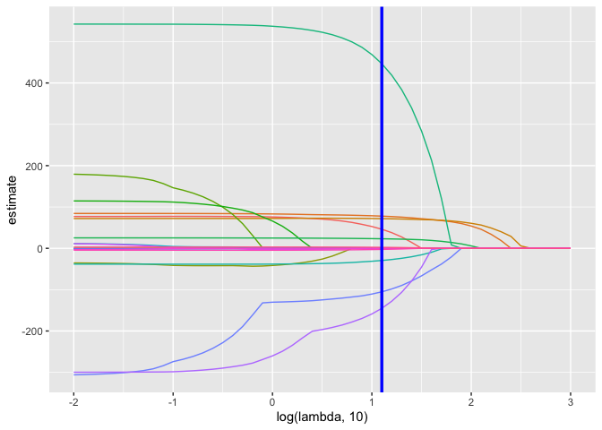
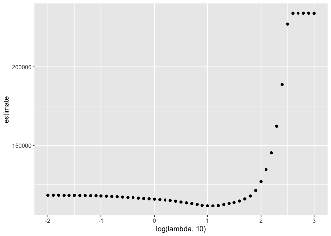

Statistical Learning
================
2022-12-01

## Lasso

To illustrate the lasso, we’ll get data from a study of factors that
affect birthweight. The code chunk below loads and cleans these data,
converts to factors where appropriate, and takes a sample of size 200
from the result.

``` r
bwt_df = 
  read_csv("./extra_topic_data/birthweight.csv") %>% 
  janitor::clean_names() %>%
  mutate(
    babysex = as.factor(babysex),
    babysex = fct_recode(babysex, "male" = "1", "female" = "2"),
    frace = as.factor(frace),
    frace = fct_recode(frace, "white" = "1", "black" = "2", "asian" = "3", 
                       "puerto rican" = "4", "other" = "8"),
    malform = as.logical(malform),
    mrace = as.factor(mrace),
    mrace = fct_recode(mrace, "white" = "1", "black" = "2", "asian" = "3", 
                       "puerto rican" = "4")) %>% 
  sample_n(200)
```

### Inputs for `glmnet`

To fit a lasso model, we’ll use `glmnet`. This package is widely used
and broadly useful, but predates the tidyverse by a long time. The
interface asks for an outcome vector `y` and a matrix of predictors `X`,
which are created next. To create a predictor matrix that includes
relevant dummy variables based on factors, we’re using `model.matrix`
and excluding the intercept

``` r
x = model.matrix(bwt ~ ., bwt_df)[,-1]
y = bwt_df$bwt
```

We fit the lasso model for each tuning parameter in a pre-defined grid
`lambda`, and then compare the fits using cross validation. I chose this
grid using the trusty “try things until it looks right” method; `glmnet`
will pick something reasonable by default if you prefer that.

``` r
lambda = 10^(seq(3, -2, -0.1))

lasso_fit =
  glmnet(x, y, lambda = lambda)

lasso_cv =
  cv.glmnet(x, y, lambda = lambda)

lambda_opt = lasso_cv$lambda.min
```

When lambda is big, we have nothing in our model, as lambda gets
smaller, more covariates get added to our model. Deviance represents
goodness-of-fit.

`cv.glmnet` does cross-validation for our models, and `lambda_opt` saves
the optimal lambda value identified from cross-validation. The best
`lambda` gives us the best prediction accuracy given the predictors we
have for the outcome of interest.

### Plotting `lasso` models

The plot below shows coefficient estimates corresponding to a subset of
the predictors in the dataset – these are predictors that have non-zero
coefficients for at least one tuning parameter value in the pre-defined
grid. As lambda increases, the coefficient values are shrunk to zero and
the model becomes more sparse. The optimal tuning parameter, determined
using cross validation, is shown by a vertical blue line.

``` r
broom::tidy(lasso_fit) %>% 
  select(term, lambda, estimate) %>% 
  complete(term, lambda, fill = list(estimate = 0) ) %>% 
  filter(term != "(Intercept)") %>% 
  ggplot(aes(x = log(lambda, 10), y = estimate, group = term, color = term)) + 
  geom_path() + 
  geom_vline(xintercept = log(lambda_opt, 10), color = "blue", size = 1.2) +
  theme(legend.position = "none")
```

<!-- -->

Penalty pulls coefficients towards 0 as lambda gets bigger. Eventually,
all coefficients get shrunk to 0 as lambda gets big - the penalty
outweighs the residual squares. The optimal lambda is indicated by the
vertical line.

The next plot shows the CV curve itself. This is relatively shallow –
having nothing at all in your model isn’t great, but you can get
reasonable predictions from models that have “too many” predictors.

``` r
broom::tidy(lasso_cv) %>% 
  ggplot(aes(x = log(lambda, 10), y = estimate)) + 
  geom_point() 
```

<!-- -->

The coefficients from the optimal model are shown below. Note we can
apply `broom::tidy` to `lasso` outputs.

``` r
lasso_fit = 
  glmnet(x, y, lambda = lambda_opt)

lasso_fit %>% broom::tidy()
```

    ## # A tibble: 12 × 5
    ##    term               step  estimate lambda dev.ratio
    ##    <chr>             <dbl>     <dbl>  <dbl>     <dbl>
    ##  1 (Intercept)           1 -3659.      12.6     0.627
    ##  2 babysexfemale         1    46.2     12.6     0.627
    ##  3 bhead                 1    77.9     12.6     0.627
    ##  4 blength               1    71.8     12.6     0.627
    ##  5 fincome               1     0.252   12.6     0.627
    ##  6 gaweeks               1    23.1     12.6     0.627
    ##  7 malformTRUE           1   447.      12.6     0.627
    ##  8 menarche              1   -29.4     12.6     0.627
    ##  9 mraceblack            1  -105.      12.6     0.627
    ## 10 mracepuerto rican     1  -145.      12.6     0.627
    ## 11 smoken                1    -2.62    12.6     0.627
    ## 12 wtgain                1     2.32    12.6     0.627

To be clear, these don’t come with p-values and it’s really challenging
to do inference. These are also different from a usual OLS fit for a
multiple linear regression model that uses the same predictors: the
lasso penalty affects these even if they’re retained by the model.

A final point is that on the full dataset, lasso doesn’t do you much
good. With \~4000 datapoints, the relatively few coefficients are
estimated well enough that penalization doesn’t make much of a
difference in this example.

## Clustering: Pokémon
